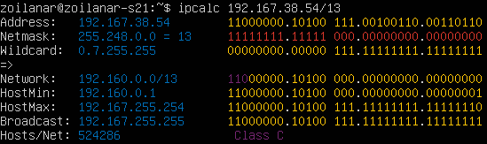
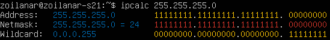
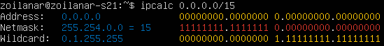
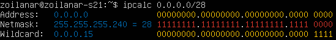
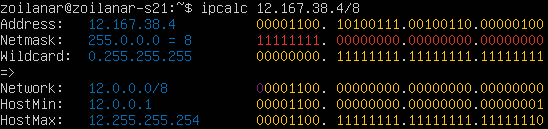
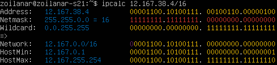
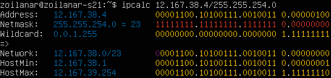
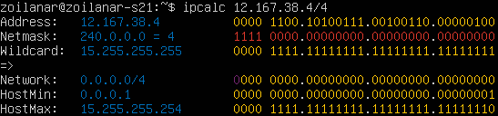

# Отчёт по проекту «Сети в Linux»

Настройка сетей в Linux на виртуальных машинах.

## Содержание 

1. [Инструмент ipcalc](#part-1)
    1.1 [Сети и маски](#11-сети-и-маски)
    1.2 [localhost](#12-localhost)
    1.3 [Диапазоны и сегменты сетей](#13-диапазоны-и-сегменты-сетей)
2. [Статическая маршрутизация между двумя машинами](#part-2-статическая-маршрутизация-между-двумя-машинами)
    2.1 [Добавление статического маршрута вручную](#21-добавление-статического-маршрута-вручную)
    2.2 [Добавление статического маршрута с сохранением](#22-добавление-статического-маршрута-с-сохранением)
3. [Утилита `iperf3`](#part-3-утилита-iperf3)
    3.1 [Скорость соединения](#31-скорость-соединения)
    3.2 [Реализация утилита `iperf3`](#32-реализация-утилиты-iperf3)
4. [Сетевой экран](#part-4-сетевой-экран)
    4.1 [Утилита `iptables`](#41-утилита-iptables)
    4.2 [Утилита `nmap`](#42-утилита-nmap)
5. [Статическая маршрутизация сети](#part-5-статическая-маршрутизация-сети)
    5.1 [Настройка адресов машин](#51-настройка-адресов-машин)
    5.2 [Включение переадресации IP-адресов](#52-включение-переадресации-ip-адресов)
    5.3 [Установка маршрута по-умолчанию](#53-установка-маршрута-по-умолчанию)
    5.4 [Добавление статических маршрутов](#54-добавление-статических-маршрутов)
    5.5 [Построение списка маршрутизаторов](#55-построение-списка-маршрутизаторов)
    5.6 [Использование протокола ICMP при маршрутизации](#56-использование-протокола-icmp-при-маршрутизации)
6. [Динамическая настройка IP с помощью DHCP](#part-6-динамическая-настройка-ip-с-помощью-dhcp)
7. [NAT](#part-7-nat)
8. [Дополнительно. Знакомство с SSH Tunnels](#part-8-дополнительно-знакомство-с-ssh-tunnels)
    

## Part 1.

#### 1.1. Сети и маски

##### 1. Адрес сети `192.167.38.54/13`;

##### 2. Перевод маски.

 - Перевод маски `255.255.255.0`:
   - В префиксную : `/24`;
   - В двоичную : `11111111.11111111.11111111.00000000`.

   

- Перевод маски `/15`:
   - В обычную : `255.254.0.0`;
   - В двоичную : `11111111.11111110.00000000.00000000`.

   
                                 

- Перевод маски `11111111.11111111.11111111.11110000`:
   - В обычную : `255.255.255.240`;
   - В префиксную : `/28`.

   

##### 3. Минимальный и максимальный хост в сети `12.167.38.4` при масках:
   - `/8`:
     - `min`: `12.0.0.1`
     - `max`: `12.255.255.254`

   

   - `11111111.11111111.00000000.00000000`:
     - `min`: `12.167.0.1`
     - `max`: `12.167.255.254`

   

   - `255.255.254.0`:
     - `min`: `12.167.38.1`
     - `max`: `12.167.39.254`

   

   - `/4`:
     - `min`: `0.0.0.1`
     - `max`: `15.255.255.254`

   

#### 1.2. localhost
`localhost` — это стандартное имя, которое используется для обращения к локальному компьютеру или к серверу на том же устройстве, на котором происходит запрос. По сути, это специальное доменное имя, которое указывает на собственное устройство.

IP-адрес `localhost` обычно представлен как 127.0.0.1, также в диапазоне этого адреса считаются IP-адреса от 127.0.0.0 до 127.255.255.255, принадлежащие к сети loopback.

Определим  можно ли обратиться к приложению, работающему на localhost, со следующими IP:

- `194.34.23.100` - нельзя обратиться;
- `127.0.0.2` - можно обратиться;
- `127.1.0.1` - можно обратиться;
- `128.0.0.1` - нельзя обратиться.

#### 1.3. Диапазоны и сегменты сетей
Служба распределения номеров `IANA (Internet Assigned Numbers Authority)` зарезервировала для частных сетей три блока адресов:
- 10.0.0.0 - 10.255.255.255 (префикс 10/8)
- 172.16.0.0 - 172.31.255.255 (префикс 172.16/12)
- 192.168.0.0 - 192.168.255.255 (префикс 192.168/16)

1. **Соответственно классифицировать адреса из задания можем так**:

  - *частные*:
     - `10.0.0.45`
     - `192.168.4.2`
     - `172.20.250.4`
     - `172.16.255.255`
     - `10.10.10.10`

  - *публичные*:
     - `134.43.0.2`
     - `172.0.2.1`
     - `192.172.0.1`
     - `172.68.0.2`
     - `192.169.168.1`

2. **Какие из перечисленных IP адресов шлюза возможны у сети `10.10.0.0/18`:**

   

  - *возможны*:
    - `10.10.0.2`
    - `10.10.10.10`
    - `10.10.1.255`

  - *невозможны*:
    - `10.0.0.1`
    - `10.10.100.1`

## Part 2. Статическая маршрутизация между двумя машинами

- Просмотр существующих сетевых интерфейсов на `WS1` с помощью команды `ip a` \

- Просмотр существующих сетевых интерфейсов на `WS2` с помощью команды `ip a` \

- Описание сетевого интерфейса `WS1` с заданным адресом `192.168.100.10` и маской `/16` \

- Описание сетевого интерфейса `WS2` с заданным адресом `172.24.116.8` и маской `/12` \

- Применение изменений с помощью команды `sudo netplan apply` на `WS1` \

- Применение изменений с помощью команды `sudo netplan apply` на `WS2` \

#### 2.1. Добавление статического маршрута вручную

- ##### Добавляю статический маршрут от одной машины до другой и обратно при помощи команды вида `ip r add` и пингу соединение:

  

  

  

  

#### 2.2. Добавление статического маршрута с сохранением

- ##### Перезапускаю машины 

- Содержание измененного файла `etc/netplan/00-installer-config.yaml` для `WS1` \
  - 
  - 

- Содержание измененного файла `etc/netplan/00-installer-config.yaml` для `WS2` \
  - 
  - 

- Пинг `WS2` с `WS1` командой: `ping -c 4 172.24.116.8` \

- Пинг `WS1` с `WS2` командой: `ping -c 4 192.168.100.10` \

## Part 3. Утилита **iperf3**

#### 3.1. Скорость соединения

- 8 Mbps (мегабит/сек) = 1 MB/s (мегабайт/сек)
- 100 MB/s (мегабайт/сек) = 800 000 Kbps (килобит/сек)
- 1 Gbps (гигабит/сек) = 1 000 Mbps (мегабит/сек)

 #### 3.2. Утилита **iperf3**

##### Измерить скорость соединения между ws1 и ws2

- Важное обратить внимание , что при использовании `iperf3`, одну машину задаем как сервер а со второй проверяем скорость. 

-  Запуск и вывод команды `iperf3 -s` на WS1, которая выступает в роли сервера \

-  Запуск и вывод команды `iperf -c 192.168.100.10` на WS2, которая выступает в роли клиента \

## Part 4. Сетевой экран

#### 4.1. Утилита **iptables**

- Содержание файла `/etc/firewall` для `WS1` \

- Содержание файла `/etc/firewall` для `WS2` \

- Запуск файла командами `sudo chmod +x /etc/firewall.sh` и `sudo sh /etc/firewall.sh` для `WS1` \

- Запуск файла командами `sudo chmod +x /etc/firewall.sh` и `sudo sh /etc/firewall.sh` для `WS2` \

- Утилита `iptables` выполняет первое прочитанное правило, остальные игнорируются. Разница между вариантами заключается в том, что на WS1 первым выполнится запрет и пинг не пройдет, а на WS2 первым стоит разрешение и пинг пройдет.

#### 4.2. Утилита **nmap**

- Пинг c WS1 командой: `ping -c 4 172.24.116.8` \

- Пинг c WS2 командой: `ping -c 4 192.168.100.10` (не «пингуется») \

- Запуск хоста машины утилитой  `nmap` \

## Part 5. Статическая маршрутизация сети

#### 5.1. Настройка адресов машин
- Настройка конфигурации машин в *etc/netplan/00-installer-config.yaml* согласно сети на рисунке:

- Содержимое файла *etc/netplan/00-installer-config.yaml* для `WS11` \

- Содержимое файла *etc/netplan/00-installer-config.yaml* для `WS21` \

- Содержимое файла *etc/netplan/00-installer-config.yaml* для `WS22` \

- Содержимое файла *etc/netplan/00-installer-config.yaml* для `R1` \

- Содержимое файла *etc/netplan/00-installer-config.yaml* для `R2` \

- Проверка адреса для `WS11` командой: `ip -4 a` \

- Проверка адреса для `WS21` командой: `ip -4 a` \

- Проверка адреса для `WS22` командой: `ip -4 a` \

- Проверка адреса для `R1` командой: `ip -4 a` \

- Проверка адреса для `R2` командой: `ip -4 a` \

- Пинг `WS22` с `WS21` командой: `ping -c 4 10.20.0.20` \

- Пинг `R1` с `WS11` командой: `ping -c 4 10.10.0.1` \

#### 5.2. Включение переадресации IP-адресов

- Для включения переадресации IP, выполняем команду на роутерах: `sysctl -w net.ipv4.ip_forward=1`
*При таком подходе переадресация не будет работать после перезагрузки системы*

- Включение переадресации IP на `R1` командой: `sysctl -w net.ipv4.ip_forward=1` \

- Включение переадресации IP на `R2` командой: `sysctl -w net.ipv4.ip_forward=1` \

- Включение переадресации IP на постоянной основе для `R1` путем изменения файла */etc/sysctl.conf* \

- Включение переадресации IP на постоянной основе для `R2` путем изменения файла */etc/sysctl.conf* \

#### 5.3. Установка маршрута по-умолчанию

- Содержимое файла *etc/netplan/00-installer-config.yaml* для `WS11` \

- Содержимое файла *etc/netplan/00-installer-config.yaml* для `WS21` \

- Содержимое файла *etc/netplan/00-installer-config.yaml* для `WS22` \

- Проверка маршрута для `WS11` командой: `ip r` \

- Проверка маршрута для `WS21` командой: `ip r` \

- Проверка маршрута для `WS22` командой: `ip r` \

- Пинг `R2` с `WS11` командой: `ping -c 4 10.100.0.12` \

- Проверка того, что пинг доходит до `R2` командой: `sudo tcpdump -tn -i enp0s8` \

#### 5.4. Добавление статических маршрутов

- Добавил в роутеры `R2` и `R2` статические маршруты в файле конфигураций:

- Содержимое файла *etc/netplan/00-installer-config.yaml* для `R1` \

- Содержимое файла *etc/netplan/00-installer-config.yaml* для `R2` \

- Вызвал `ip r` и отобразил таблицы с маршрутами на обоих роутерах:
  
- **r1**
- 

- **r2**
- 

- Запустил команды на `WS11`:

  Маршрут для сети *10.10.0.0/18* сети более конкретный и подробный, чем маршрут по умолчанию *0.0.0.0/0*. Более специфический маршрут обычно имеет более высокий приоритет при принятии решения о маршрутизации.

#### 5.5. Построение списка маршрутизаторов

- С помощью утилиты `traceroute` построил список маршрутизаторов на пути от `WS11` до `WS21`.

- **ws1**
- 

- **r1**
- 

- `traceroute` - это утилита в сетевых операционных системах, таких как Linux и Windows, которая используется для отслеживания маршрута сетевых пакетов от отправителя до указанного удаленного узла. `traceroute` помогает идентифицировать промежуточные узлы (маршрутизаторы), через которые проходят пакеты, и определить время задержки для каждого из них.

Вот как работает `traceroute`:

  - Когда вы запускаете `traceroute` и указываете IP-адрес или доменное имя удаленного узла, ваш компьютер начинает отправлять серии ICMP (или UDP) пакетов к удаленному узлу.

  - Каждый пакет делает "прыжок" через сеть от вашего компьютера к удаленному узлу через различные маршрутизаторы.

  - Для каждого прыжка маршрутизатор отвечает на ICMP-запрос `traceroute` и отправляет обратно информацию о своем IP-адресе, времени пинга и т.д.

  - `traceroute` выводит информацию о каждом промежуточном узле, его IP-адрес, время задержки (ping), а также количество прыжков (Hop Count), через которые проходит пакет.

  - После отправки определенного количества пакетов (обычно 3 для каждого узла), `traceroute` завершается, показывая итоговый маршрут к указанному удаленному узлу.

#### 5.6. Использование протокола ICMP при маршрутизации

- Запустил на `R1` перехват сетевого трафика, проходящего через eth0 с помощью команды:
`tcpdump -n -i eth0 icmp`

  - **r1**

- Пропинговал с `WS11` несуществующий IP (например, *10.30.0.111*) с помощью команды:
`ping -c 1 10.30.0.111`  

  - **ws11**

## Part 6. Динамическая настройка IP с помощью DHCP

- Устанавливаем службу DHCP командой: `sudo apt install isc-dhcp-server`

- **r2**:
  - Содержимое файла */etc/dhcp/dhcpd.conf* 

 
  - Содержимое файла */etc/resolv.conf* 

  - Перезагрузка службы **DHCP** командой `systemctl restart isc-dhcp-server` для `R2` \

  - Перезагрузка `WS21` командой: `sudo reboot`

  - Проверка полученного адреса `WS21` командой: `ip a` \

  - Пинг `WS11` с `WS21` командой: `ping -c 4 10.20.0.8` \

- **r1**  

- Содержимое файла *etc/netplan/00-installer-config.yaml* для `WS11` \

- Содержимое файла */etc/dhcp/dhcpd.conf* для `R1` \

- Содержимое файла */etc/resolv.conf* для `R1` \

- Перезагрузка службы **DHCP** командой `systemctl restart isc-dhcp-server` для `R1` \

- Перезагрузка `WS11` командой: `sudo reboot`

- Проверка полученного адреса `WS11` командой: `ip a` \

- Пинг `WS22` с `WS11` командой: `ping -c 4 10.20.0.20` \

-  Смотрим IP до обновления с `WS21` командой: `ip a` \

-  Запрашиваем обновление IP адреса с `WS21` командой: `sudo dhclient enp0s8`
-  Смотрим IP после запроса с `WS21` командой: `ip a` \

## Part 7. NAT

- Устанавливаем `apache2` с помощью команды `sudo apt install apache2`
- В файле `/etc/apache2/ports.conf` на `WS22` и `R1` изменяю строку *Listen 80* на *Listen 0.0.0.0:80*
- **r1**

- **ws22**
- 

- Запускаю веб-сервер `apache2` командой `service apache2 start` на `WS22` и `R1`.
- **r1**
- 

- **ws22**
- 

- Добавляю в фаервол, созданный по аналогии с фаерволом из Части 4, на `R2` следующие правила:

  Где: 
   - Удаление правил в таблице `filter - iptables -F`;
   - Удаление правил в таблице "NAT" - `iptables -F -t nat`;
   - Отбрасывать все маршрутизируемые пакеты - `iptables --policy FORWARD DROP`.  

- Запустил фаерволл командой `sudo sh /etc/firewall.sh`
- Проверил соединение между `WS22` и `R1` командой `ping.`
- **ws22 to r1**
- 

- **r1 to ws22**
- 

- Добавляем в файл ещё одно правило: Разрешить маршрутизацию всех пакетов протокола ICMP.

- Проверяем соединение между `WS22` и `R1` командой `ping`.
- **ws22 to r1**
- 

- **r1 to ws22**
- 

- Добавляем в файл еще два правила

- Проверяем соединение по TCP для SNAT: для этого с `WS22` подключаемся к серверу `apache2` на `R1` командой `telnet [адрес][port]`

- Проверяем соединение по TCP для DNAT: для этого с `R1` подключиться к серверу `apache2` на `WS22` командой `telnet` (обращаемся по адресу `R2` и порту *8080*).

## Part 8. Дополнительно. Знакомство с SSH Tunnels

Направление трафика в пределах одной локальной сети.

- Запускаем на `R2` фаервол с правилами из Части 7 командой `sudo sh /etc/firewall.sh`

- Запустили веб-сервер `apache2` на `WS22` только на localhost , с помощью команды `service apache2 start`
  

- Используя `Local TCP forwarding` с `WS21` до `WS22`, получили доступ к веб-серверу на  `WS22` с `WS21`.
  

- Для проверки выполняем команду `telnet 127.0.0.1 [локальный порт]`
- 

- Используя Remote TCP forwarding c `WS11` до `WS22`, чтобы получить доступ к веб-серверу на `WS22` с `WS11`.
  
  
- Для проверки выполняем команду `telnet 127.0.0.1 [локальный порт]`
- 